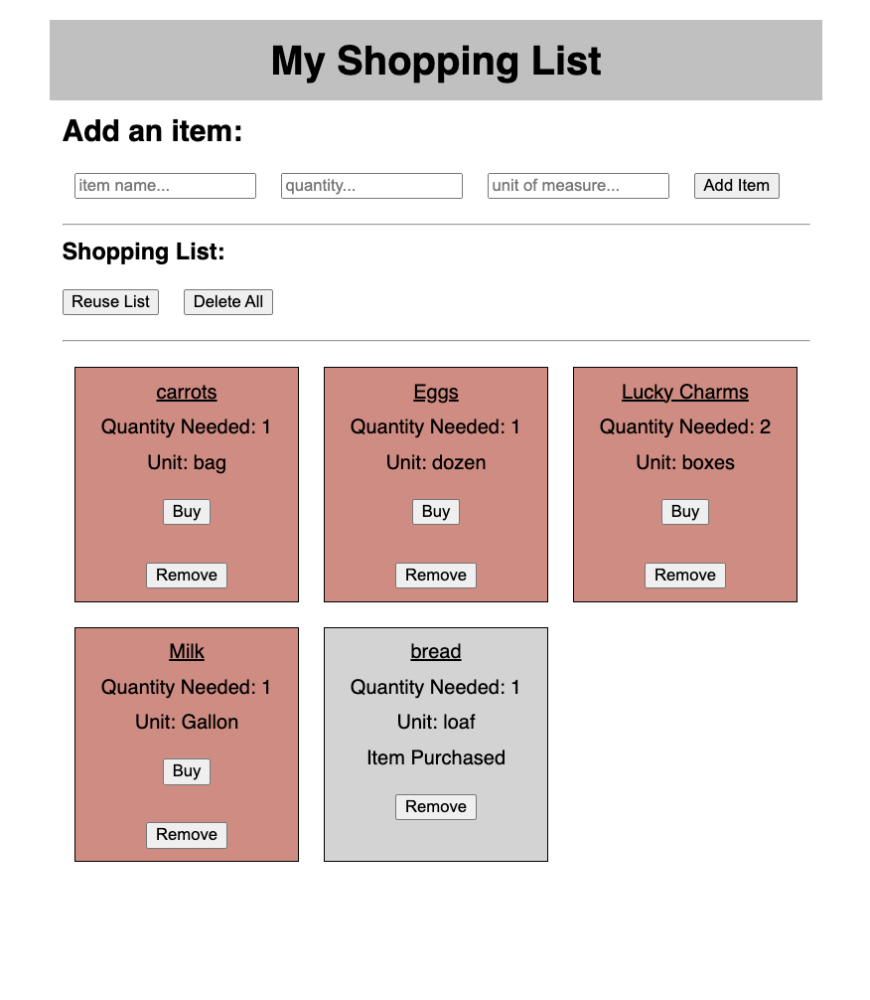

# React Shopping List
## Description

This project involved developing a fully-functioning Shopping List CRUD in order to keep track of purchases and provide a reusable list for multiple trips to the grocery store. Each item can be purchased and sent to the bottom of the list, or removed entirely. 

The list can also be cleared of all purchases or deleted, however those functions warn the user before executing to prevent accidental deletion of important information.

The list is presented in large, conveniently-spaced boxes so each item and its quantity are easy to read and distinguish from other items.

### Screenshot

### Skills Practiced
- Javascript
- Express & Node
- React
- HTML & CSS

### Steps
#### Steps taken to build this project:
- [x] Creation of SQL database
- [x] Creating a route document for server requests
- [x] POST requests for adding new items
- [x] Form for receiving inputs (item, quantity, unit of measure)
- [x] GET requests for displaying the full list
- [x] PUT requests to purchase items or clear purchases
- [x] DELETE requests to remove items or delete entire list
- [x] Form input separated into separate component
- [x] Shopping list display separated into component
- [x] Individual items separated into their own components
- [x] Ensuring correct GET requests each time list changes
- [x] CSS formatting to improve usability

### Built With:
- Javascript
- React
- Express & Node.js
- Postgres & Postico

### Acknowledgments 

Thanks to Prime Digital Academy for challenging us to grow!

### Team Members
This project was built by Ben Rehmann, Brock Nelson, Chris Cantoni, J Read, Zach Andrade